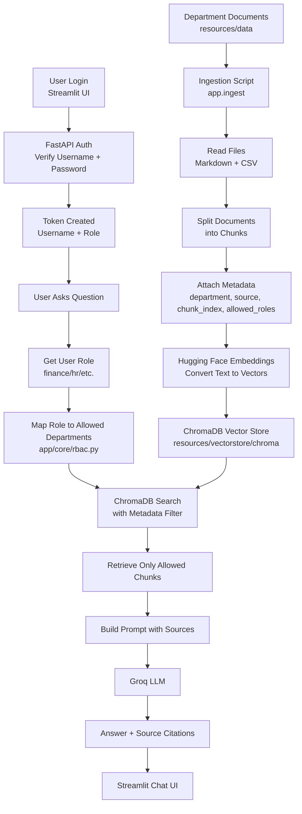

# Role-based_RAGchatbot

## Internal Chatbot with Role-Based Access Control

A RAG-based internal company chatbot that answers questions from department-specific documents while enforcing role-based access control.

The chatbot supports Finance, Marketing, HR, Engineering, Employee, and C-Level Executive roles. Each user only retrieves data allowed for their role, and every answer includes source references from the retrieved documents.

## Features

- FastAPI backend
- Streamlit chat interface
- JWT-style token authentication
- Role-based access control
- LangChain RAG pipeline
- Hugging Face cloud embeddings
- ChromaDB persistent vector store
- Groq LLM response generation
- Source citations for retrieved documents
- Department-wise document access

## Tech Stack

| Layer | Technology |
| --- | --- |
| Backend | FastAPI |
| Frontend | Streamlit |
| RAG Orchestration | LangChain |
| Embeddings | Hugging Face Inference API |
| Vector Store | ChromaDB |
| LLM | Groq |
| Auth | Token-based authentication |

## Project Structure

```text
Role-based_RAGchatbot/
  app/
    core/
      config.py
      rbac.py
      security.py
    schemas/
      auth.py
      chat.py
    services/
      rag.py
      users.py
    ingest.py
    main.py
  resources/
    data/
      engineering/
      finance/
      general/
      hr/
      marketing/
    vectorstore/
      chroma/
  streamlit_app/
    app.py
  .env
  requirements.txt
  README.md
```

## How RBAC Works

Documents are stored department-wise under `resources/data`.

## Complete Workflow




## How the Project Works

The project has two main phases:

1. **Indexing phase**
2. **Chat phase**

### 1. Indexing Phase

The indexing phase prepares company documents for semantic search.

Run:

```bash
python -m app.ingest
```

This calls:

```text
app/services/rag.py -> rebuild_vector_store()
```

What happens internally:

1. The app scans folders under `resources/data`.
2. The folder name is treated as the document department.
3. Files are read from Finance, Marketing, HR, Engineering, and General folders.
4. Long files are split into smaller chunks.
5. Each chunk is converted into a LangChain `Document`.
6. Each chunk receives metadata.
7. Hugging Face converts each chunk into an embedding vector.
8. ChromaDB stores the vector, text, and metadata.

Example stored chunk:

```text
Text:
Q2 marketing spend was $550 million...

Metadata:
department = finance
source = quarterly_financial_report.md
chunk_index = 4
allowed_roles = executive,finance
```

This means the vector is searchable, but it still carries department-level access information.

### 2. Chat Phase

The chat phase happens when a user asks a question.

Example:

```text
What was the Q2 marketing spend?
```

Flow:

1. User logs in from Streamlit.
2. FastAPI verifies the username and password.
3. Backend creates a token containing the user's role.
4. User sends a question.
5. Backend reads the user's role from the token.
6. Role is mapped to allowed departments.
7. ChromaDB is searched using both:
   - semantic similarity
   - department metadata filter
8. Retrieved chunks are passed to Groq.
9. Groq generates an answer using only those chunks.
10. UI displays answer and sources.

For example, if `sam` logs in:

```text
sam -> finance role
finance role -> access to general + finance
```

The ChromaDB search is filtered to:

```text
department in ["general", "finance"]
```

So `sam` cannot retrieve HR or Engineering chunks.

If `pepper` logs in:

```text
pepper -> executive role
executive role -> access to all departments
```

So executive users can retrieve from:

```text
general, finance, marketing, hr, engineering
```

Important security boundary:

```text
User Role -> Allowed Departments -> Chroma Metadata Filter -> Retrieved Context -> Groq Answer
```

The LLM does not decide authorization. The backend filters data before the LLM sees it.

## Roles and Access

| Role | Accessible Data |
| --- | --- |
| Employee | General company information |
| Finance | General + Finance |
| Marketing | General + Marketing |
| HR | General + HR |
| Engineering | General + Engineering |
| Executive | General + Finance + Marketing + HR + Engineering |

Role permissions are defined in:

```text
app/core/rbac.py
```

## Demo Users

Demo users are defined in:

```text
app/services/users.py
```

| Username | Password | Role |
| --- | --- | --- |
| `tony` | `password123` | Engineering |
| `bruce` | `securepass` | Marketing |
| `sam` | `financepass` | Finance |
| `natasha` | `hrpass123` | HR |
| `steve` | `employeepass` | Employee |
| `pepper` | `executivepass` | Executive |

These passwords are for demo purposes only.

## Setup Instructions

### 1. Clone the repository

```bash
git clone https://github.com/Akash-8004/Role-based_RAGchatbot.git
cd Role-based_RAGchatbot
```

### 2. Create a virtual environment

Windows:

```powershell
python -m venv .venv
.venv\Scripts\activate
```

macOS/Linux:

```bash
python -m venv .venv
source .venv/bin/activate
```

### 3. Install dependencies

Windows:

```powershell
.venv\Scripts\python.exe -m pip install -r requirements.txt
```

macOS/Linux:

```bash
python -m pip install -r requirements.txt
```

### 4. Add API keys

The project includes a `.env` file in the root directory. Open it and put your API keys there.

Required values:

```text
HUGGINGFACEHUB_API_TOKEN=your_hugging_face_token
GROQ_API_KEY=your_groq_key
```

Recommended defaults:

```text
HF_EMBEDDING_MODEL=sentence-transformers/all-mpnet-base-v2
GROQ_MODEL=llama-3.3-70b-versatile
CHROMA_COLLECTION=company_documents_hf
RAG_TOP_K=4
RAG_MIN_RELEVANCE_SCORE=0.2
TOKEN_EXPIRE_MINUTES=120
SECRET_KEY=change-this-secret-for-production
```

## Build the Vector Store

Run ingestion once after adding API keys. This embeds documents and stores them in ChromaDB.

Windows:

```powershell
.venv\Scripts\python.exe -m app.ingest
```

macOS/Linux:

```bash
python -m app.ingest
```

The ChromaDB vector store is saved under:

```text
resources/vectorstore/chroma/
```

Run ingestion again whenever you add or update files in `resources/data`.

## Run the Backend

Windows:

```powershell
.venv\Scripts\python.exe -m uvicorn app.main:app --host 127.0.0.1 --port 8000
```

macOS/Linux:

```bash
python -m uvicorn app.main:app --host 127.0.0.1 --port 8000
```

Backend URL:

```text
http://127.0.0.1:8000
```

API docs:

```text
http://127.0.0.1:8000/docs
```

Useful endpoints:

| Method | Endpoint | Purpose |
| --- | --- | --- |
| GET | `/health` | Check API and RAG index status |
| GET | `/demo-users` | List demo users |
| POST | `/auth/login` | Login and get token |
| GET | `/me` | Get current user profile |
| POST | `/chat` | Ask a role-filtered question |

## Run the Streamlit UI

Open a second terminal and run:

Windows:

```powershell
.venv\Scripts\streamlit.exe run streamlit_app/app.py
```

macOS/Linux:

```bash
streamlit run streamlit_app/app.py
```

Streamlit will open in the browser, usually at:

```text
http://localhost:8501
```

If your FastAPI backend uses a different URL:

Windows:

```powershell
set API_BASE_URL=http://127.0.0.1:8000
.venv\Scripts\streamlit.exe run streamlit_app/app.py
```

macOS/Linux:

```bash
export API_BASE_URL=http://127.0.0.1:8000
streamlit run streamlit_app/app.py
```

## Example Test Flow

1. Start the backend.
2. Start Streamlit.
3. Select a demo user.
4. Enter the matching password from `app/services/users.py`.
5. Ask a question.
6. Check that returned sources match the user's allowed department access.

Example prompts:

| User | Query | Expected Result |
| --- | --- | --- |
| `steve` | What is the work from home policy? | General handbook answer |
| `sam` | What was the Q2 marketing spend? | Finance source answer |
| `bruce` | Summarize campaign ROI in 2024. | Marketing source answer |
| `natasha` | Show employee attendance and salary insights. | HR source answer |
| `tony` | What is the high-level system architecture? | Engineering source answer |
| `pepper` | Compare finance, marketing, HR, and engineering priorities. | Full-access answer |

## API Example

Login:

```bash
curl -X POST http://127.0.0.1:8000/auth/login \
  -H "Content-Type: application/json" \
  -d "{\"username\":\"sam\",\"password\":\"<password-from-users.py>\"}"
```

Ask a question:

```bash
curl -X POST http://127.0.0.1:8000/chat \
  -H "Content-Type: application/json" \
  -H "Authorization: Bearer <TOKEN>" \
  -d "{\"message\":\"What was the Q2 marketing spend?\"}"
```

## Troubleshooting

### `HUGGINGFACEHUB_API_TOKEN is missing`

Open `.env` and add your Hugging Face API token.

### `GROQ_API_KEY is missing`

Open `.env` and add your Groq API key.

### No relevant answer found

Run ingestion again:

```bash
python -m app.ingest
```

Also check that files exist under:

```text
resources/data/
```


## Notes

- `resources/vectorstore/` can be regenerated by running ingestion.
- Demo users are for project demonstration only.
